# EJERCICIOS DE REDES DOCKER

### ✅ Ejercicio 1 — Crear tres redes Docker personalizadas

<b>

#### Crea tres redes Docker, cada una con su propia IP y rango.

🔵 Red A — redA
Subred: 10.10.10.0/24
Gateway: 10.10.10.1
Rango: 10.10.10.50 – 10.10.10.60
🟢 Red B — redB
Subred: 20.20.20.0/24
Gateway: 20.20.20.1
Rango: 20.20.20.100 – 20.20.20.120
🔴 Red C — redC
Subred: 30.30.30.0/24
Gateway: 30.30.30.1
Rango: 30.30.30.150 – 30.30.30.160

</b>
 
<b>

Creacion de redes.

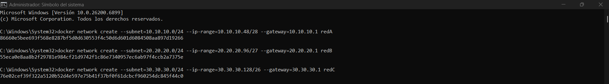

                          

Red A

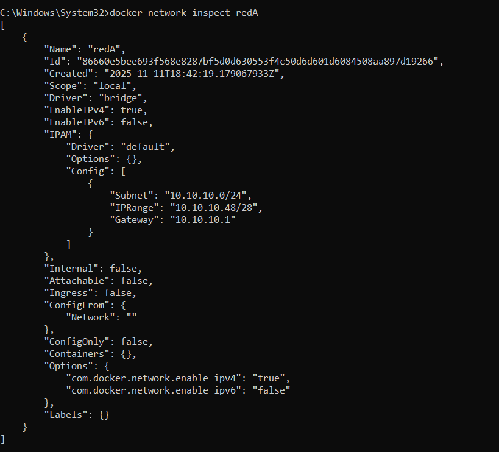

                

Red B

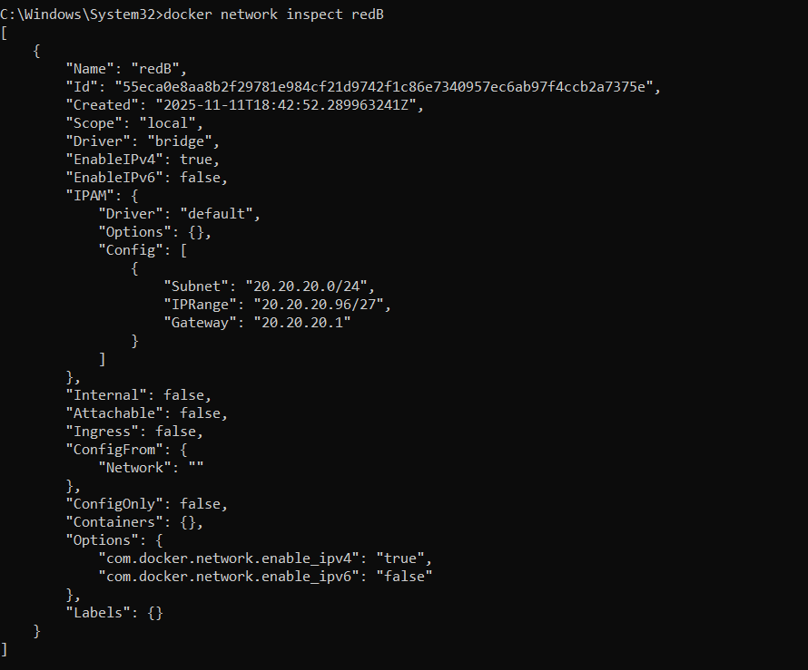

                  

Red C

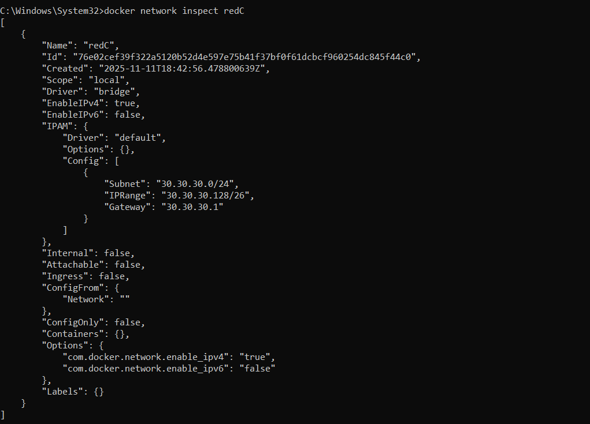

✅ Ejercicio 2 — Lanzar DOS contenedores en cada red
(todos distintos)
Debes usar SEIS contenedores, todos con un sistema operativo diferente.

✅ En redA deben lanzarse:
Contenedor Imagen SO
a1 ubuntu Ubuntu
a2 fedora Fedora

✅ En redB deben lanzarse:
Contenedor Imagen SO
b1 debian Debian
b2 centos:7 CentOS

✅ En redC deben lanzarse:
Contenedor Imagen SO
c1 alpine Alpine
c2 rockylinux Rocky Linux

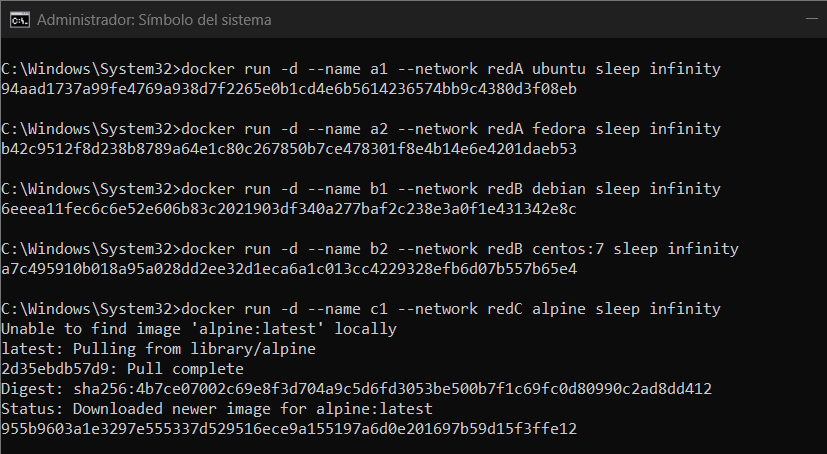

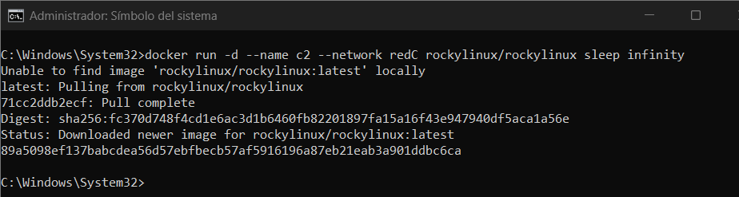

                  

✅ Ejercicio 3 — Crear un contenedor conectado a las TRES
redes
Crea un contenedor llamado multired3 basado en Fedora que debe pertenecer a:
redA
redB
redC
Tareas:
Lanzarlo inicialmente en redA.
Conectarlo después a redB y redC.
Verificar 3 interfaces con ip addr.

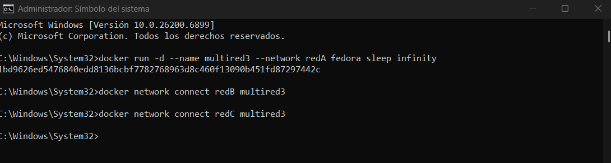

Instalamos los paquetes de red

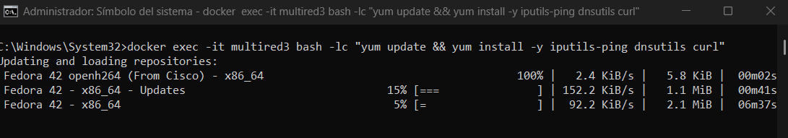

Ip address

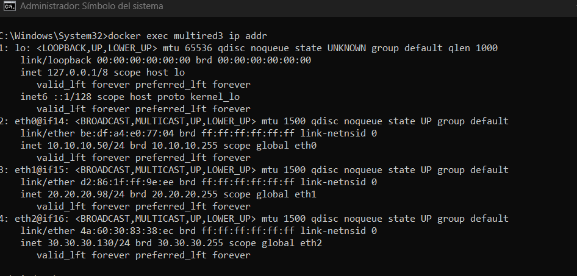

       

✅ Ejercicio 4 — Crear un contenedor conectado a DOS
redes
Crea un contenedor llamado multired2 basado en distroless o busybox que debe pertenecer
a:
redA
redC
Tareas:
Implantación de Sistemas Operativos 1º ASIR
Profesora: Ana Fuentes 2/3
Inicialmente lanzarlo en redC.
Añadirlo a redA.
Verificar interfaces: 2 direcciones IP

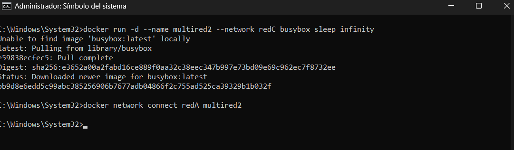

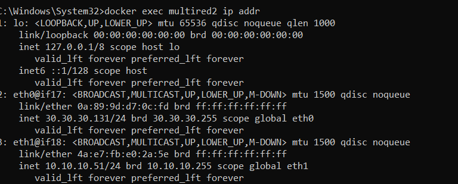

                  

✅ Ejercicio 5 — Comprobación de conectividad
✅ 5.1 Comunicaciones dentro de la misma red
a1 ↔ a2
b1 ↔ b2
c1 ↔ c2

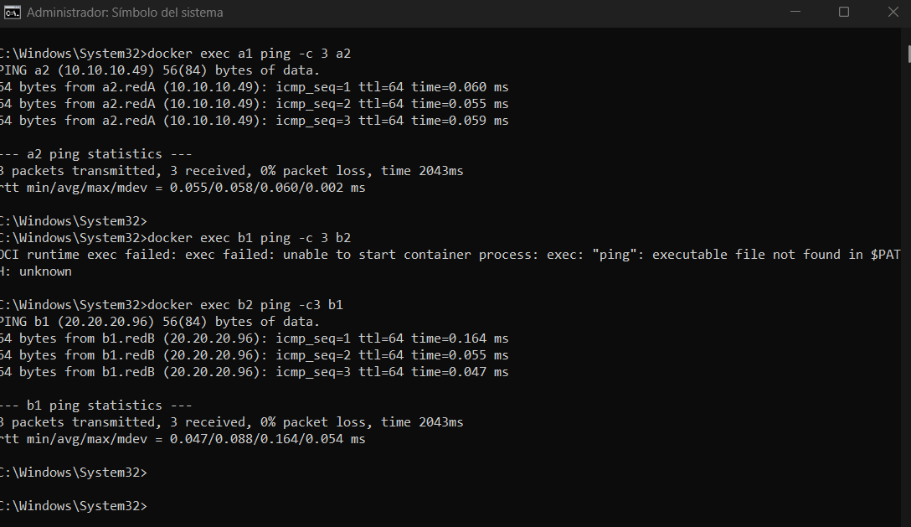
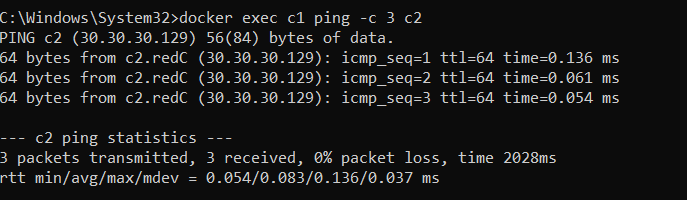

               

✅ 5.2 Comunicaciones de los contenedores multired
🟦 multired3 (opensuse) debe alcanzar:
a1 (Ubuntu), a2 (Fedora)
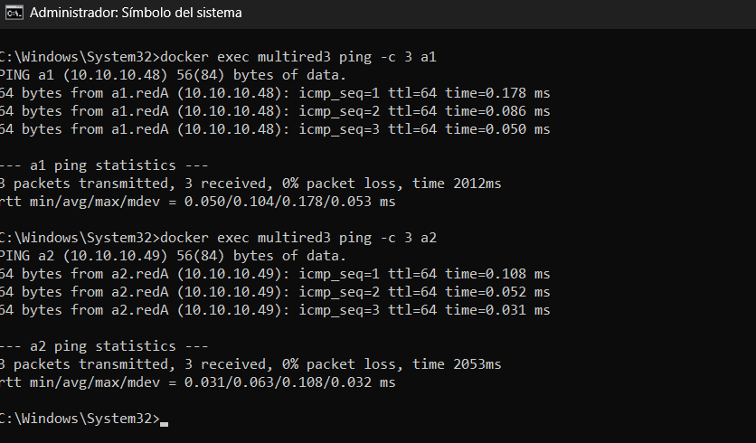
b1 (Debian), b2 (CentOS)
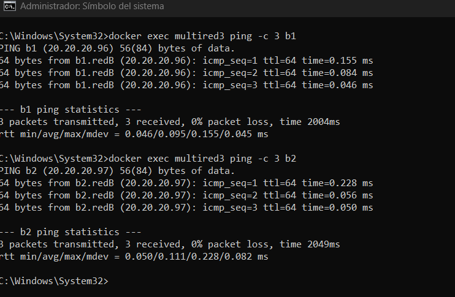
c1 (Alpine), c2 (Rocky)
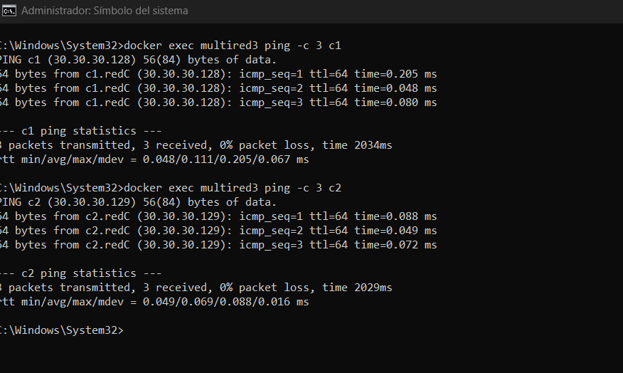

🟧 multired2 (busybox/distroless) debe alcanzar solo:
a1, a2 (por redA)
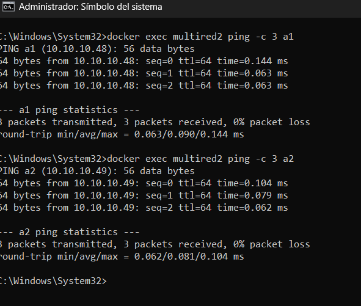
c1, c2 (por redC)
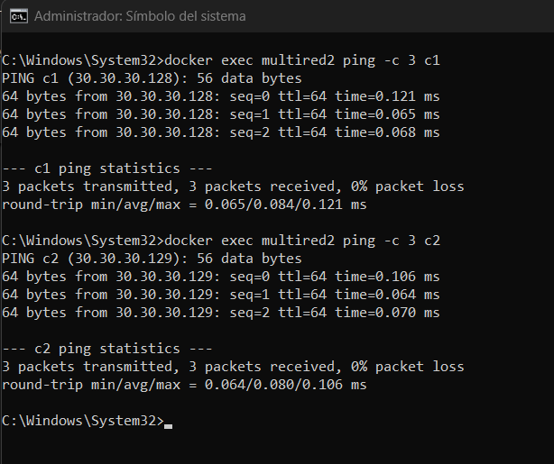
  
✅ 5.3 Aislamiento esperado
a1 NO debe alcanzar b1
b2 NO debe alcanzar c1
a2 NO debe alcanzar c2

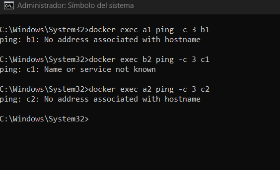

