## 👤 Miguel Ángel García Cortés

<b>

## 🟢 Nivel 1 – Fundamentos: imágenes y contenedores

---

1️⃣ Ejercicio 1.1 – Primer contacto con Alpine Linux Descarga y ejecuta un contenedor de Alpine Linux. 

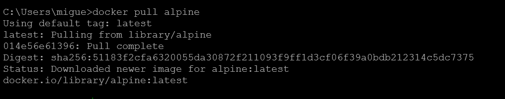

Comprueba su tamaño, entra en modo interactivo y muestra la versión del sistema.

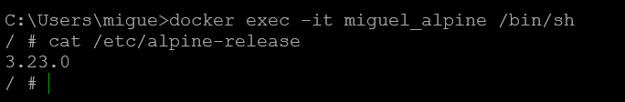
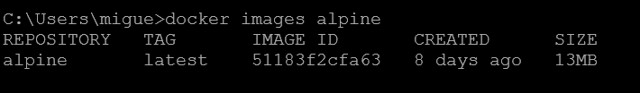

---

2️⃣ Ejercicio 1.2 – Comprobando BusyBox Busca en Docker Hub la imagen oficial de BusyBox, descárgala, ejecútala y verifica qué comandos básicos tiene disponibles.

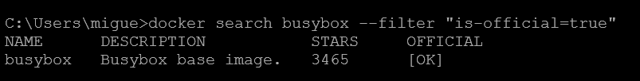

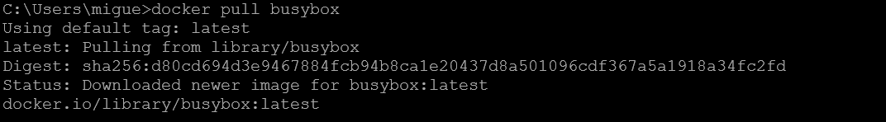

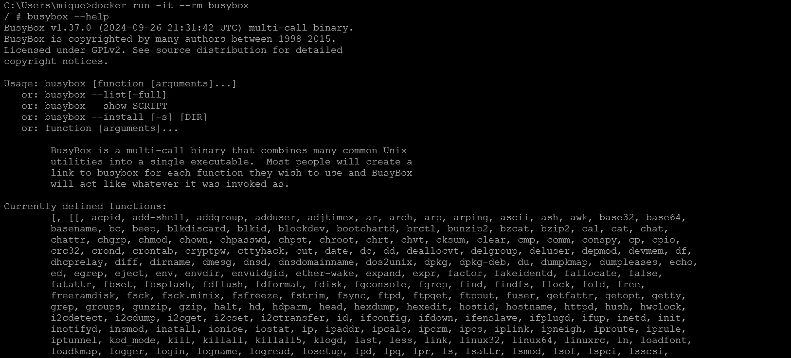

---

3️⃣ Ejercicio 1.3 – Contenedor CentOS Descarga la imagen oficial de CentOS y crea un contenedor que permanezca activo.

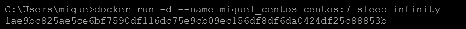

Verifica su versión y deténlo

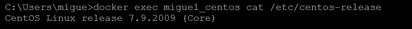

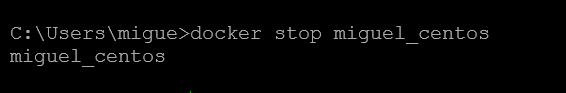

---

4️⃣ Ejercicio 1.4 – Explorando contenedores Lista todos los contenedores (en ejecución o detenidos), inspecciona uno para ver su dirección IP interna, y elimina aquellos que ya no necesites.

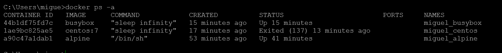

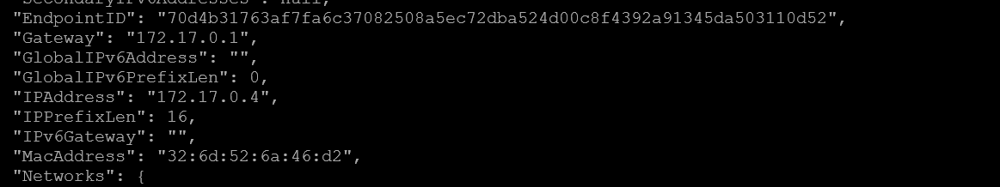

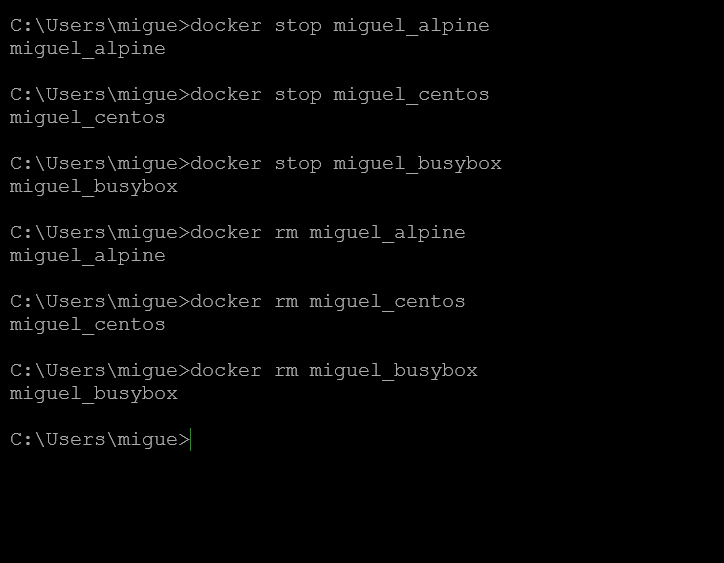

---

5️⃣ Ejercicio 1.5 – Información del sistema Docker Muestra información detallada de tu instalación Docker (versiones, almacenamiento, redes, etc.) y localiza el directorio donde se guardan las imágenes.

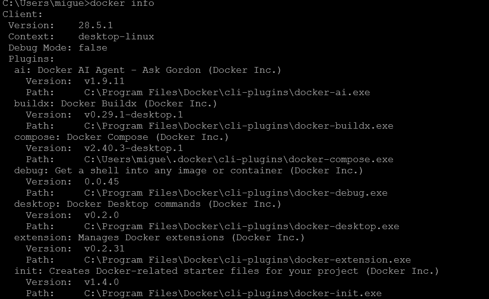

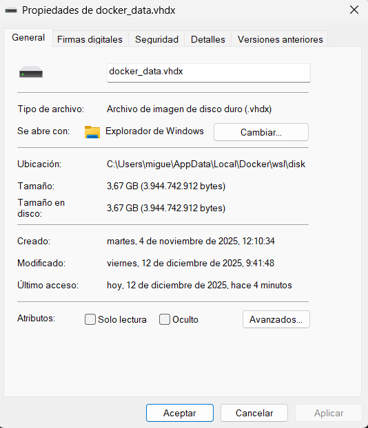

---

## ⚪ Nivel 2 – Redes docker

---

6️⃣ Ejercicio 2.1 – Creando una red personalizada Crea una red llamada red_lab y lanza en ella tres contenedores de diferentes distribuciones pequeñas (alpine, busybox, centos).

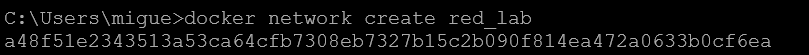

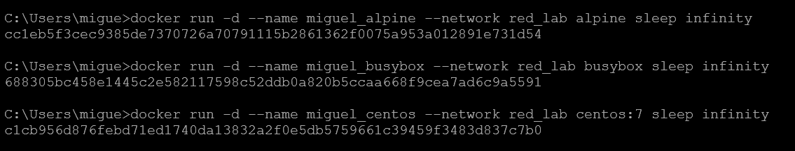

Comprueba que pueden hacerse ping entre sí por nombre.

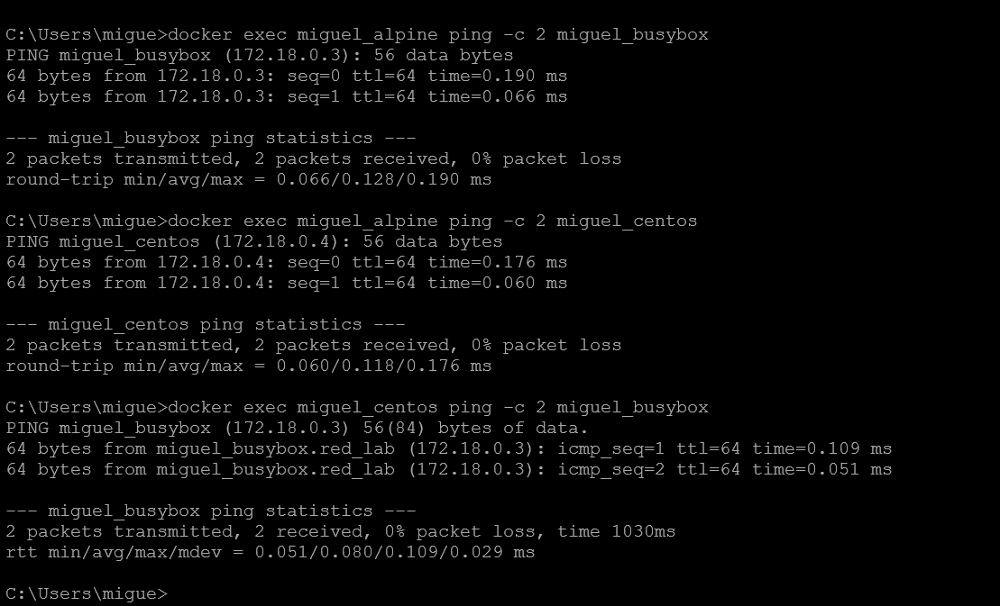

---

7️⃣ Ejercicio 2.2 – Un contenedor en dos redes Crea una segunda red llamada red_extra y conecta uno de los contenedores anteriores a ambas redes.

Comprueba su configuración de red interna.

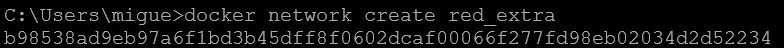

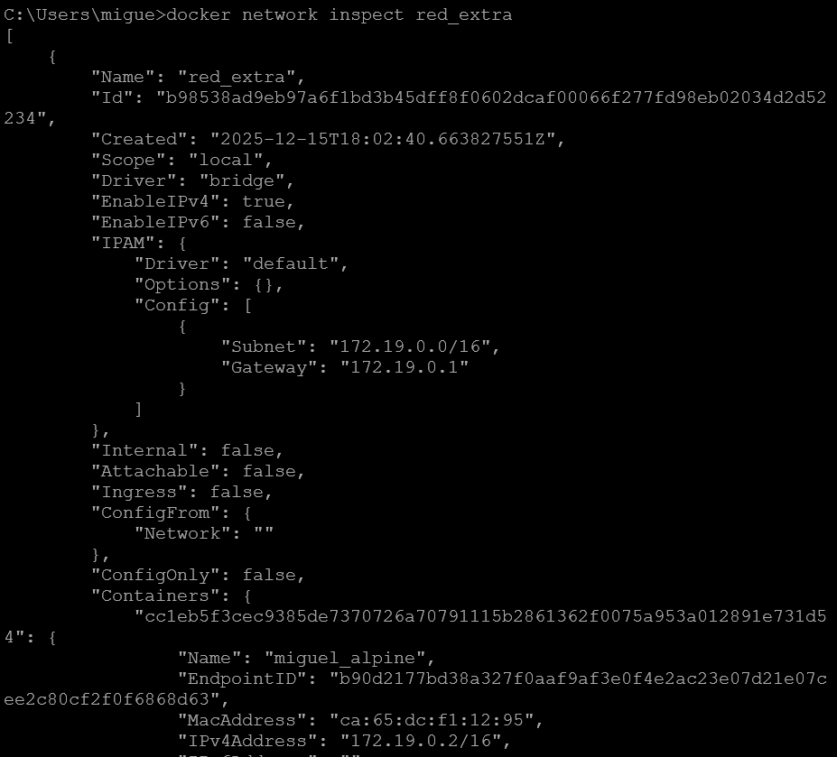

---

8️⃣ Ejercicio 2.3 – Servidor HTTP temporal Dentro de un contenedor python:3-alpine, inicia un servidor web con python3 -m http.server 8080 y accede a él desde otro contenedor de la misma red usando curl.

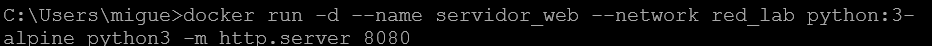

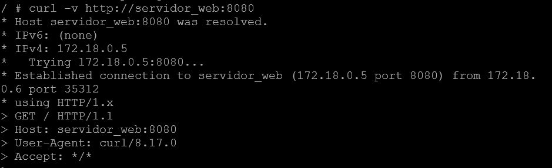

---

## 🔵 Nivel 3 – Volúmenes y persistencia

---

9️⃣Ejercicio 3.1 – Volumen compartido entre contenedores.

Crea un volumen llamado compartido y monta dicho volumen en dos contenedores distintos (alpine y busybox).

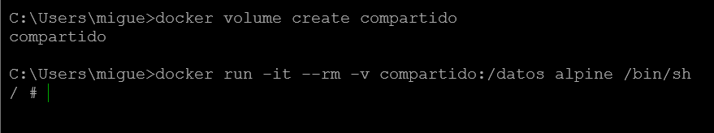

Guarda un archivo en uno y verifica que aparece en el otro.

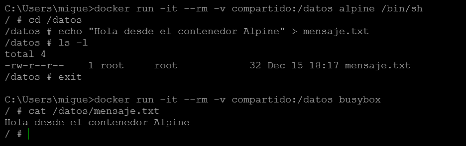

---

1️⃣0️⃣Ejercicio 3.2 – Volumen persistente con Alpine Lanza un contenedor alpine montando un volumen llamado vol_asir en la carpeta /datos. 

Dentro del contenedor crea un archivo llamado mensaje.txt con el texto Hola ASIR. 

Elimina el contenedor y lanza otro nuevo utilizando el mismo volumen. 

Comprueba que el archivo mensaje.txt sigue existiendo y conserva su contenido original.

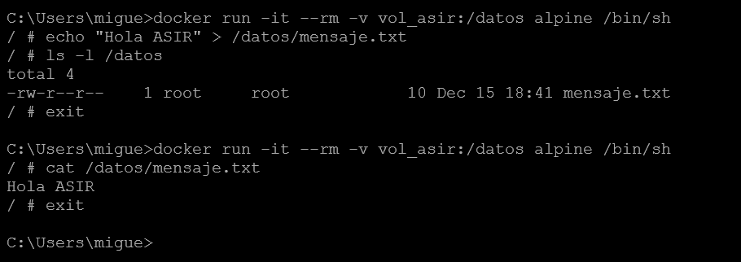

---

## ⚫ Nivel 4 – Mantenimiento y limpieza

---

1️⃣1️⃣Ejercicio 4.1 – Limpieza y diagnóstico del entorno Lista imágenes, contenedores, volúmenes y redes. 

Elimina los elementos que no estén en uso. 

Comprueba cuánto espacio ocupa Docker en tu sistema antes y después.

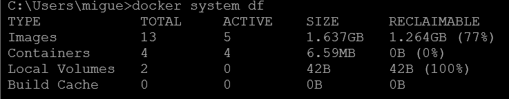

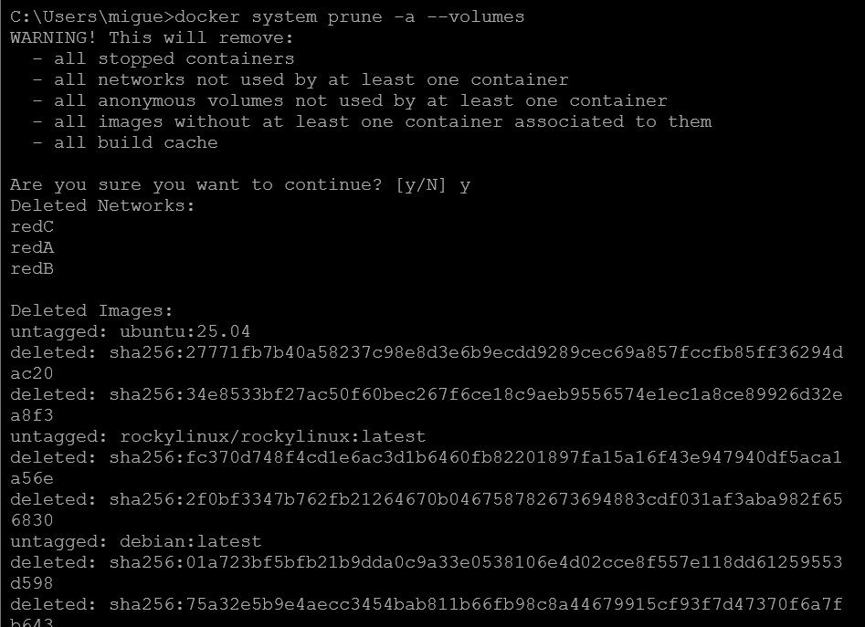

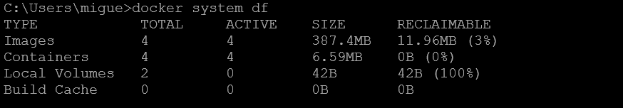