# ❄️ LINUX AVANZADO

## 🌟 AWS 

#### ⚡VPC

**VPC**
1. Solo vpc
1. Nombre VPC
1. Entrada manual de CIDR UPv4
1. CIDR UPv4 (IP) --> VPC
1. Sin bloque CIDR UPv6
1. Creamos

**Subredes**
1. Elijamos Nuestra vpc
1. Nombre Subred
1. Zona disponibilidad
1. Bloque CIDR de la subred UPv4
1. Crear subred

**Puerta de enlace de internet (Configurar gateway)**
1. Eligamos Nombre Gateway
1. Creamos

**Asociamos a una vpc**
1. Elegimos nuestra vpc
2. Asociamos

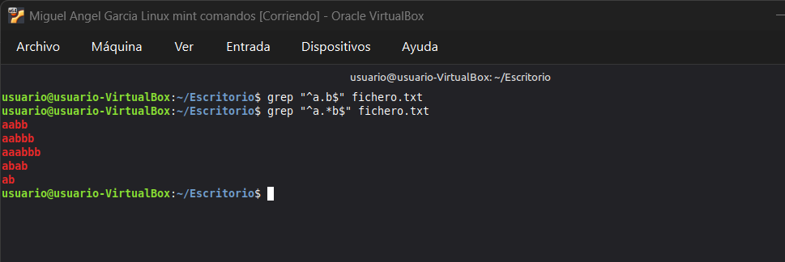

**Tabla de enrutamiento**
1. Nombre de la tabla
1. Seleccionamos VPC
1. Creamos

- Seleccionamos la tabla
- Rutas > Agregamos ruta
- Elegimos 0.0.0.0/0
- Puerta de enlace de Internet
- Elegimos nuestra gateway > Guardar cambios
- Seleccionamos Editar asociaciones de subredes
- Añadimos nuestra subred creada > Guardar cambios

**Subredes**
- Elegimos la subred creada
- Tabla de enrutamiento
- Editar la asociación
- Id de tabla de enrutamiento
- Guardamos

#### ⚡EC2

**Creamos grupo de seguridad (Security group)**
- Nombre del grupo de seguridad
- Asignamos nuestra Descripción
- Asignamos Nuestra VPC

**En reglas de entrada** 
- TCP Personalizado
- SSH
- Todo el tráfico
- Regla icmp Personalizado IPv4

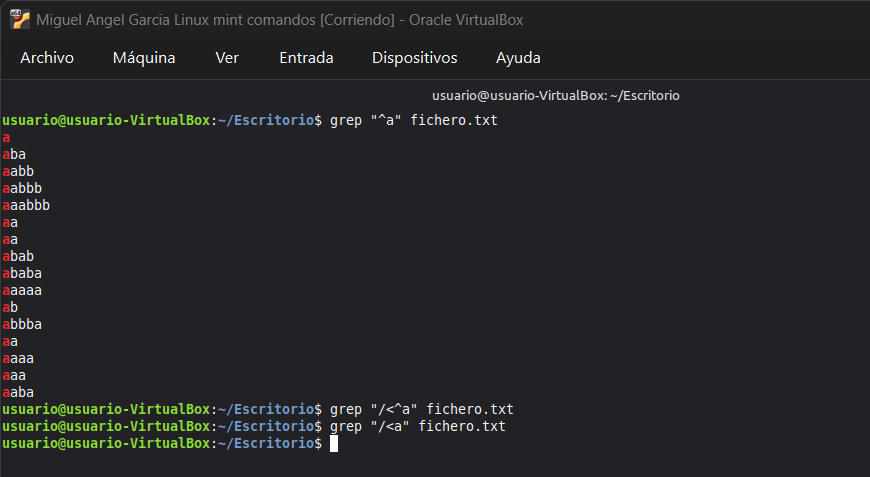

**En reglas de salida** 
- TCP Personalizado
- SSH
- Todo el tráfico
- Regla icmp Personalizado IPv4
- HTTP
- HTTPS

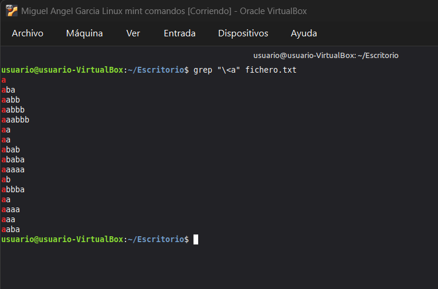

- Debajo de cada uno Añadimos Anywhere-IPv4 / 0.0.0.0/0

**Creamos Instancia**
1. Editamos configuración
    - Ponemos nuestra VPC
    - Ponemos nuestra subred
    - Activa asignar ip pública automatica
    - Elegimos grupo de seguridad

    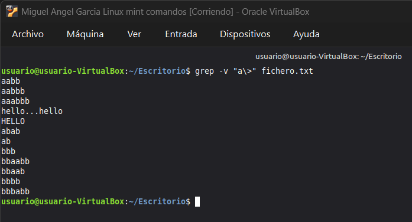   

**Creamos volumenes**

- Hay dos formas y una de ellas es desde la instancia:

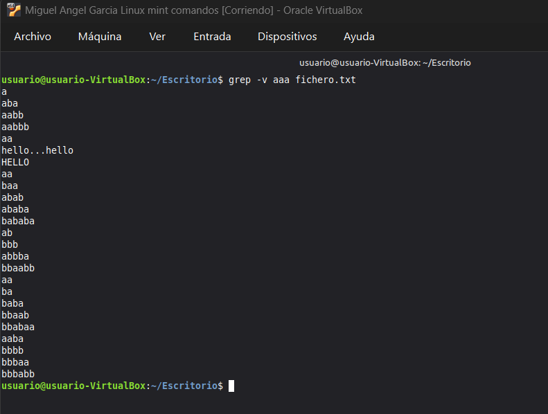

- Y la segunda es desde el apartado volumenes
    - Le damos un tamaño
    - Zona de disponibilidad
    - Lo creamos
    - Escogemos de uno > acciones > asociar volumen
    - Elegimos la instancia
    - Y el nombre del dispositivo (Aunque no funciones)
> Por defecto le dan el nombre de nvme{1-9}n1

<br>

## 🌕 Comandos
<b>
Todos los discos se encuentran en la carpeta /dev

<br><br>

Debemos tener en cuenta que los /sda son el sistema operativo.
</b>

### 🔥 DISCOS Y PARTICIONADO

##### ⚡ Comandos de información

```bash
df 

#Muestra los discos y particiones montadas, con menos información


fdisk -l 

# Muestra toda la información de solo los discos, y particiones, montados o no.
```

##### ⚡ Fdisk


<b> 

Crear particion primaria

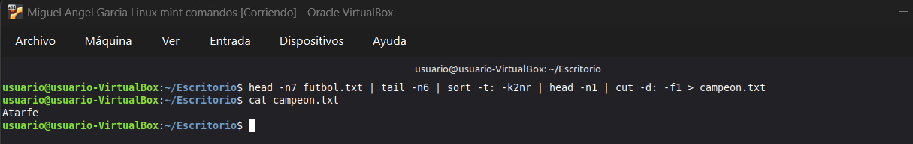

Crear partición extendida

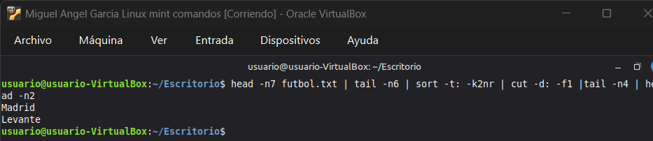

Eliminar particiones

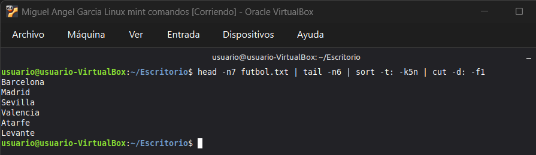

Crear particiones lógicas

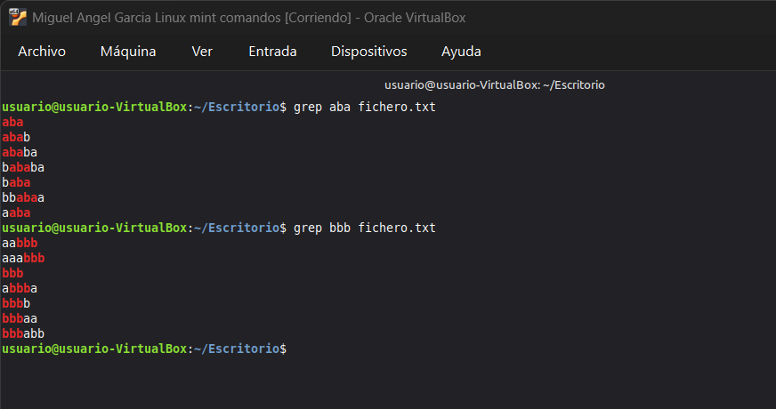


##### ⚡ Formatear

```bash

sudo mkfs.|Sistema de archivos| /dev/particion|Disco

sudo mkfs.ntfs /dev/sdb1

```

##### ⚡ Asignar de forma temporal

Creamos una carpeta para enlazarla, con mkdir en /mnt

```bash
mkdir /mnt/backup

mount -t auto /dev/sdb1 /mnt/backup

# Para desenganchar la particion de la carpeta

umount /dev/sdb1

```

##### ⚡ Asignar de forma permanente

Para ver la id usaremos blkid

```bash
sudo blkid   /   sudo blkid | grep particion | cut -d" " -f3 >> /etc/fstab
#Si no deja hacerlo con root

sudo nano fstab

#Tras tener esto debemos de hacer unmount -a y mount -a, reiniciar la máquina para asegurarnos
```
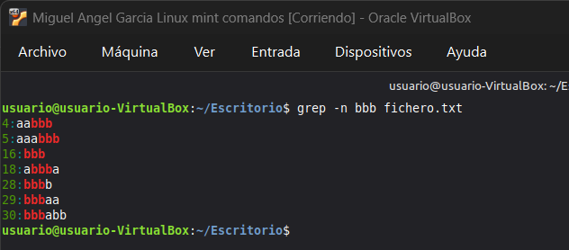

### 🔥 RAIDS

```bash

#Es recomendable particionar el disco con fdisk, antes de usarlo para el raid.

#Una vez particionado el disco usamos:

1 mdadm | Si no lo tenemos apt install mdadm

# Para crearnos el raid 1 pondremos la siguiente sintaxis:


2 mdadm –C /dev/md0 --level=raid1 --raid-devices=2 /dev/sdb1 /dev/sdc1

_______________________________

-C /dev/md0 → #Para que se cree el sistema raid, y se llamará md0, que es como se llaman a 
# los sistemas raid (md0, md1, md2,…).

--level=raid1 → #Indica el tipo de raid. En este caso raid 1.

- -raid-devices=2 → #Indica el número de unidades que voy a utilizar. En este caso 2.

/dev/sdb1 /dev/sdc1 → #Indica los dos dispositivos que voy a utilizar.

_______________________________

3 Formateamos la unidad

mkfs.ext4 /dev/md0

|Es posible que tengamos que montar el md antes|

_______________________________

4 Ver los detalles del raid

mdadm --detail /dev/md0

|Aqui aparece el UID|

_______________________________

5 Montamos el raid igual que una particion, tanto para permanente como para temporal

mount –t auto /dev/md0 /mnt/hdd

_______________________________

6 Vemos que está montado 

df –h

_______________________________

7 Pruebas del disco

|Durante todo esto podremos ver con detail los pasos|

Simulamos un fallo con:  |SOLO SI ES RAID 1 (ESPEJO) !!!|

mdadm --fail /dev/md0 /dev/sdb1

Los archivos deben seguir hay.

ls /mnt/hdd

Eliminamos el disco que falla

mdadm --manage /dev/md0 --remove /dev/sdb1

Añadimos un disco que no falle

mdadm --manage /dev/md0 --add /dev/sdb1

_______________________________

8 Eliminar un raid

mdadm --stop /dev/md0
mdadm --remove /dev/md0

o si no funciona.

mdadm --stop /dev/md0
mdadm --misc --zero-superblock /dev/sdb1
mdadm --misc --zero-superblock /dev/sdc1

```


### 🔥 CUOTAS DE DISCO

```bash

Creamos nuestras particiones

Formateamos nuestras particiones

Montamos permanentemente la particion

#Una vez hecho esto vamos con las cuotas.

_______________________________

Limitaremos el espacio de el disco elegido.

1 Instalamos el paquete quota

    apt install quota

_______________________________

2 Creamos un usuario para asignarle la cuota

    useradd -d /directorio-permanente -m usuario

    passwd usuario

_______________________________

3 Editamos el fichero /etc/fstab, y añadimos en la línea donde está 
montada mi unidad lo siguiente: 

    defaults,usrquota,grpquota

#Montamos y desmontamos la unidad para que se refresque.

```


```bash
_______________________________

4 Escribimos para chequear:

    quotacheck -cug /directorio-permanente

_______________________________

5 Damos de alta la unidad:

    quotaon /directorio-permanente

_______________________________

6.1 Asignamos una cuota con:

    edquota usuario /directorio-permanente

6.2 Para grupos:

    edquota -g nombre_grupo /directorio-permanente

#Nos mostrara los archivos con quotas.

Si queremos limitar el espacio usaremos el bloque blando y duro.

    Blando: Es un advertencia del espacio que le queda.

    #Es decir cuando ocupe la cantidad de blando, recibirá una advertencia.

    Duro: Es el espacio real al que está limitado.

    #Cuando llegue al limite, no podrá usar más.

Si queremos limitar el numero de ficheros usarmeos inodos.

Una vez cerremos el archivo guardando, se aplican los cambios.

_______________________________

7 Si queremos ver la quota usaremos:

    quota usuario

_______________________________

8 Desactivar la quota

    quotaoff -aug /directorio-permanente

```

### 🔥 VOLUMENES

```bash

_______________________________


1 Instalamos el paquete lvm2

_______________________________


2 Creamos volumenes fisicos con

[pvcreate /dev/disco /dev/disco ...]

o

[pvcreate /dev/nvme{1,2,3,4...}n1]

_______________________________


3 Vemos detalles con

[pvdisplay]

_______________________________


4 Para crear grupos de volumenes

[vgcreate nombre_grupo /dev/disco /dev/disco ...]

_______________________________


5 Para ver detalles de los dispositivos en volumenes

[pvs]

_______________________________


6 Para ver los detalles de los grupos

[vgs]

_______________________________


7 Para crear un volumen logico

#PRIMERO DEBE ESTAR CREADO EL GRUPO

[lvcreate -L TAMAÑO -n nombre_lv nombre_grupo]

_______________________________


8 Formateamos el volumen

# LISTAR VOLUMENES LOGICOS [LVS]

sudo mkfs.|Sistema de archivos| /dev/volumen_logico

_______________________________


9 Para montar permanentemente un volumen

[blkid /dev/GRUPO/volumen]

Copiamos el UID y lo metemos como con las particiones en fstab.

_______________________________


10 Hacemos umount -a y mount -a para recargarlo una vez acabado.

_______________________________


11 Para ampliar un grupo

[vgextend GRUPO /dev/disco_nuevo]

_______________________________


12 Para cambiar el tamaño de un volumen logico

#DEBEMOS TENER SUFICIENTE TAMAÑO PARA AMPILIARLO EN EL GRUPO

lvresize -L +-TAMAÑO --resizefs -n /dev/grupo/volumen

_______________________________


13 SNAPSHOT

[lvcreate --size TAMAÑO --snapshot --name nombre_snap /dev/grupo/volumen_a_copiar]

Podemos montarlo permanentemente si queremos.

_______________________________


```

### 🔥 NFS 

```bash
# hacerlo en sudo su mejor
# Instalamos en ubuntu server lo siguiente

sudo apt install nfs-kernel-server nfs-common rpcbind

# Instalamos en ubuntu cliente lo siguiente y volvemos al servidor...

sudo apt-get install nfs-common rpcbind

# Ahora creamos la carpeta que queremos compartir en /var , le añadimos como usuario y grupo nobody:nogroup
# nobody:nogroup = Esto significa que no tendra ni dueño ni grupo , que sera para todos
# y luego lo comprobamos

- mkdir -p /var/compartido
- chown nobody:nogroup /var/compartido
- ll /var/compartido

# ahora lo configuramos el nfs entromos en /etc/exports

- Sudo nano /etc/exports 

# añadimos abajo la siguiente linea con un rango de ip de a quienes será compartido
# si solo vas a compartir a una maquina no le damos rango 
# y entre parentesis se le asigna permisos 
# sync para que se valla actualizando la configuracion sola

/var/compartido 192.168.1.101(rwx,sync)
/var/compartido 192.168.1.101(rwx,sync) ---> si fuera con rango de ipes

# Ahora iniciamos el servicio y le creamos un fichero dentro con permisos

/etc/init.d/nfs-kernel-server start
echo "descripcion" >> /etc/compartido/fich1.txt
chmod 777 /var/compartido/fich1.txt

# ahora creamos en ubuntu cliente un montaje para los recursosNFS
# le damos permisos totales a el y todo lo que venga con -R
# y lo montamos

mkdir -p /mnt/recursosNFS
chmod -R 777 /mnt/recursosNFS/
sudo mount IP_server:/var/compartido
```

### 🔥 SERVICIO SAMBA

```bash
_______________________________

1 Las maquinas deben de estar en la misma red, si es virtual estará en una red interna.

_______________________________

2 Actualizamos el servidor y cliente con apt update.

_______________________________

3 En el servidor instalaremos los paquetes samba, samba-common y el smbclient usando apt install.

_______________________________

4 Crearemos los usuarios que usaremos en samba previamente con 

[useradd nombre] |Creamos usuarios|

[groupadd nombre] |Creamos grupos|

[adduser nombre_usuario nombre_grupo] |Añadimos usuarios a grupos|

Luego creamos la carpeta.

[sudo mkdir -p /dir/dir]

Podemos cambiar el dueño con

[chown usuario:grupo directorio]

Podemos cambiar los permisos con chmod a nuestro gusto.

_______________________________

5 Gestion de usuarios a la base de datos de samba.

#DEBEN ESTAR PREVIAMENTE CREADOS EN EL SERVIDOR

sudo smbpasswd -a usuario

-a -> Añade

-x -> Elimina

-d -> Deshabilita

-e -> Habilita

Podemos ver los usuarios añadidos a samba con

[pdbedit -L]

_______________________________

6 El fichero de configuracion de samba es /etc/samba/smb.conf

Bajamos abajo del todo, creamos una seccion con las almohadillas para indicar.

# Ponemos un nombre 

[nombre]

La estructura es la siguiente

# Ruta del directorio que usaremos

path = /dir/dir 

# Comentario opcional

comment = "Comentario"

# Permite desconocidos?

guest ok = yes/no

# Solo lectura

read only = yes/no

# Usuarios validos en el samba

valid users = usuarios @grupos

# Usuarios que pueden escribir en la carpeta del samba

write list = usuarios

# Despues de acabar la configuracion

sudo systemctl restart smbd

```
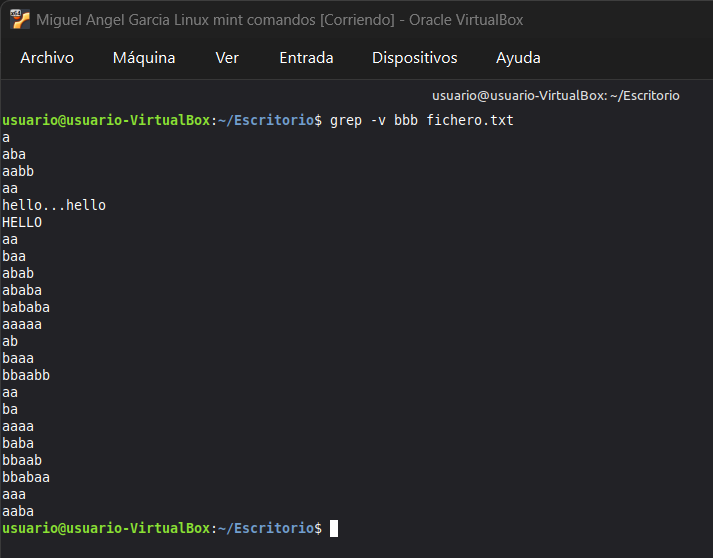

```bash
_______________________________

7 Cliente de linux SMB

Instalamos el paquete smbclient

[sudo apt install smbclient]

_______________________________

8 Interactuar con los recursos SI ES GRAFICO

Para ver los recursos del servidor

[smbclient --list 192.168.1.101]

Entramos al servidor.

```
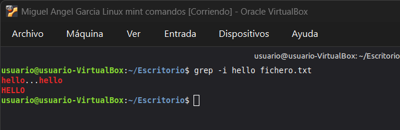
```bash

Desde aqui podemos conectarnos al servidor con todos los usuarios y añadir diversos archivos o carpetas.

_______________________________

9 Interactuar con los recursos SI NO ES GRAFICO

Instalamos el paquete cifs-utils

Creamos una carpeta en mnt

Lo montamos con:

[mount -t cifs  //IP_SERVIDOR/directorio carpeta_creada -o username=nombre_usuario]

[mount -t cifs  //192.168.1.101/datos /mnt/datos -o username=javier]

_______________________________

10 Cliente de Windows SMB

Configuramos la red y quitamos el firewall.

Presiona la tecla Windows + R, escribe optionalfeatures y pulsa Enter.

Buscamos la opcion "Compatibilidad con el protocolo para compartir archivos SMB 1.0/CIFS".

Desplegamos y marcamos "Cliente SMB 1.0/CIFS".

Aceptar y reiniciar


Si usamos guest ok ponemos en powershell:

Set-SmbClientConfiguration -EnableInsecureGuestLogons $true

_______________________________

11 Conectarse al servidor desde windows

En el buscador de windows \\IP_SERVIDOR\RECURSO

Tras estro introducimos credenciales y podemos interactuar con los ficheros y directorios, dependiendo de los permisos

# Debemos tener en cuenta que la sesion se queda iniciada una vez entremos

Reinicia el servicio de Estación:

Pulsa Windows + R, escribe services.msc y pulsa Enter.

Busca el servicio llamado Estación (Workstation).

Haz clic derecho y dale a Reiniciar.

```