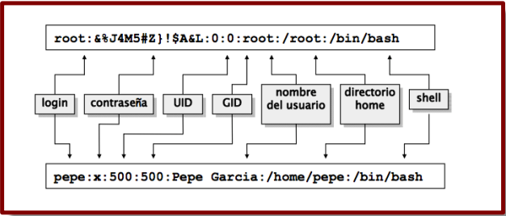
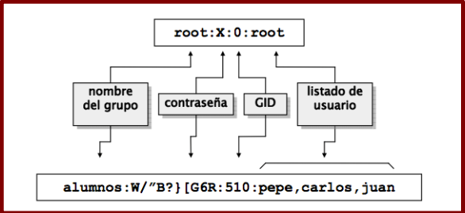
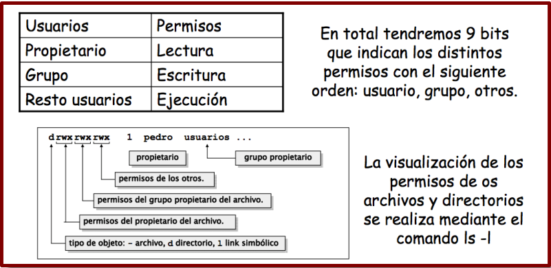
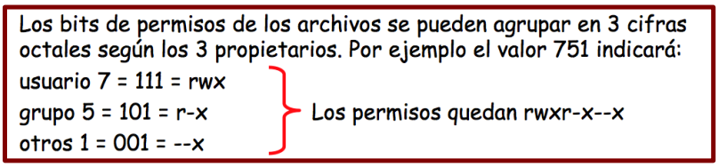
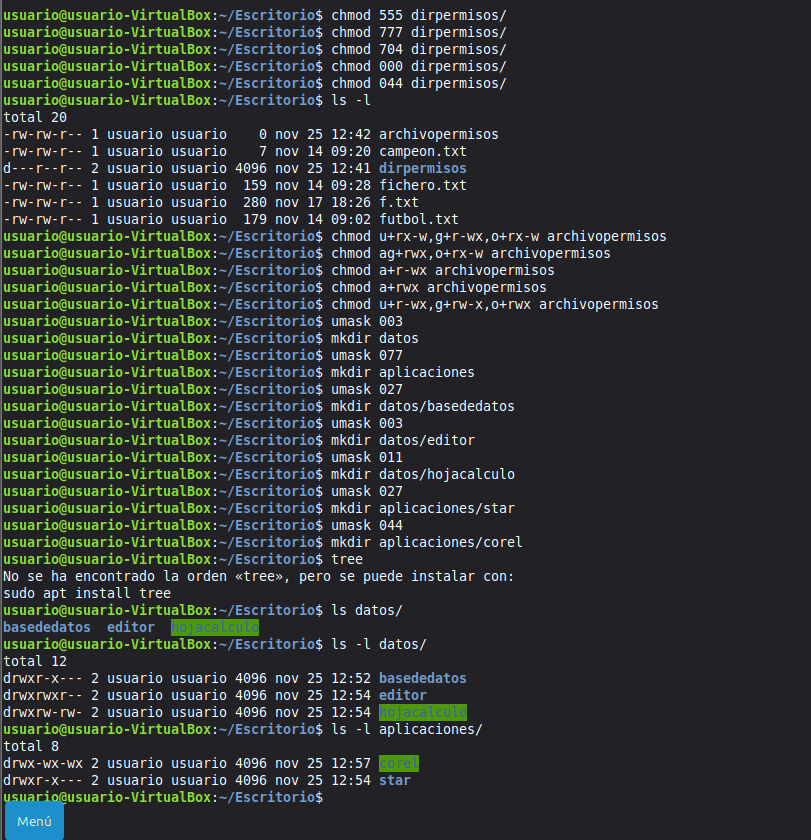
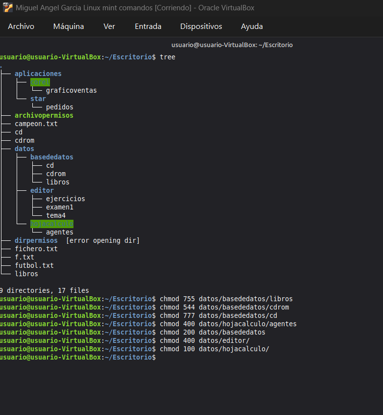

# :full_moon: Comandos de linux
## :white_flag: Autor: Miguel Ángel García
---

## :first_quarter_moon: Terminos

<b> :exclamation: Archivos a tener en cuenta </b>

- Archivo sencillo (-): Puede contener datos o texto, o ser un ejecutable.

- Directorio (d): En esencia, es un archivo que lista otros archivos.

- Vínculo (l): También llamado enlace simbólico. Se utiliza para que un archivo o directorio sea accesible desde otro lugar del sistema

<b> :question: Direcciones de directorios interesantes </b>

- / →Raíz del sistema de archivos.
- /bin → Almacena la mayoría de los programas esenciales del sistema.
- /boot → Archivos utilizados por el cargador de arranque del sistema.
- /dev → Contiene archivos especiales del sistema, conocidos como controladores
de dispositivo (device drivers), los cuales se usan para acceder a los dispositivos del sistema y recursos, como discos duros, modems, memoria, etc.
- /etc →Este directorio está reservado para los ficheros de configuración y arranque del sistema Linux.
- /home →Contiene los directorios personales de los usuarios.
- /mnt →Punto de montaje. Montar temporalmente otros sistemas de archivos.
- /root →Directorio hogar del administrador del sistema.
- /sbin →Contiene programas esenciales del sistema, que son únicamente accesibles
al administrador (root).
- /tmp →Archivos temporales del sistema.
- /usr→Este directorio contiene los programas de uso común para todos los usuarios.
- /var →Este directorio contiene información temporal de los programas (lo cual no implica que se pueda borrar su contenido)
---

## :last_quarter_moon: Teoria

Si alado del usuario hay un # indica que es root.

En caso contrario es un usuario comun.

Para crear un fichero oculto, el nombre debera tener un . delante: .NOMBRE

Sintasis basica de los comandos
<b>

    <comando> <opciones> <argumento>

</b>


---

## :moon: Comandos básicos

<b> ⚡ PWD Permite ver el usuario a y la ruta </b>
```bash
    pwd
```

<b> ⚡ CD Nos permite movernos entre los directorios </b>
```bash
    
    cd /directorio/directorio  
    (Ruta absoluta, poner todo el camino)

    cd ../../directorio/directorio 
    (Retira niveles en directorios yluego avanza hasta el que  queremos, esto es ruta absoluta)

    cd directorio 
    (Nos lleva a un directorio contiguo al que estamos,es una ruta relativa.)
```

<b> ⚡ LS Listar contenido y sus variantes </b>
```bash

    ls (Lista contenido)
    ls -l (Lista el contenido con mas información)
    ll (Listar contenido totalmente completo)
    ls /directorio/directorio (Lista los directorios en concreto)

    Variantes

    -l listado en formato largo incluyendo permisos, usuario, grupo, etc.
    -t ordenado por fecha de modificación.
    -a lista todos los ficheros, incluso los que empiezan por punto, alfabéticamente.
    -s tamaño de los ficheros en bloques.
    -r muestra el listado en orden inverso, ya sea alfabéticamente (ls –lr) o por tiempos (ls -ltr).
    -R se incluyen los contenidos de los subdirectorios recursivamente
```

<b> Indica que usuario tengo </b>
```bash

    who (Da la informacion del usuario)
    whoami (Dice el usuario en uso)
```

<b> Indica la fecha </b>
```bash

    date (Dice la fecha)
    cal AÑO (Te dice el calendario del año indicado, o el mes)
```

<b> ⚡ Comando de ayuda </b>
```bash

    man COMANDO (Es un comando de manual y ayuda. Se sale con la Q)
```

<b> ⚡ MKDIR Creacion de directorios </b>
```bash
    
    mkdir /directorio/directorio/NOMBRE_DIRECTORIO

    mkdir /directorio/directorio/{A,B} 
    (Crea varios directorios en la ruta)

    mkdir -p /directorio/DIRECTORIO_NO_EXISTE/NOMBRE_DIRECTORIO
    (Crea el directorio que ponemos en caso de que no existe, incluida su ruta.)

    mkdir a /home/b /home/e
    (Crea varios directorios, 1 en raiz, 2 en home)
```

<b> ⚡ RM o RMDIR Eliminación de directorios / archivos </b>
```bash
    rmdir /directorio/directorio_borrable
    (Sin contenido dentro)

    rm -r /directorio/directorio_borrable
    (Elimina directorios con contenido dentro)

    rm /directorio/FICHERO
    (Elimina el fichero que queremos)

    rm -f /directorio/directorio
    (Elimina directorio sin confirmación)
```

<b> ⚡ CAT Visualizar archivos </b>

```bash
    cat (Visualiza ficheros)
```
<b> ⚡ CP Copiar cosas </b>
```bash

    cp ORIGEN DESTINO
    (Puede haber varios origenes pero solo un destino)

    cp -r ORIGEN DESTINO 
    (Copia todo el contenido de forma recursiva)
```

<b> ⚡ MV Mover a otro destino </b>

```bash
    mv ORIGEN DESTINO
```

<b> Less leer fichero </b>

```bash
    less fichero
    (Leer fichero por partes)
```

<b> ⚡ TOUCH Crear ficheros vacios </b>
```bash
    touch nombrefichero
```
<b> ⚡ Listar el contenido de directorios de forma visual </b>

```bash
    tree 
    (Muestra que tengo en la ruta que indique, o en la que estoy)
```
<b> ECHO Escribe dentro de ficheros y repite </b>

```bash
    echo "Prueba de echo" > fichero.txt
```

<b>🚩 WC Contar lineas y plabras de un fichero </b>

```bash
    wc fichero.txt
    -l Lineas
    -w Palabras
    -c Caracteres
```

<b> Redireccionar la salida </b>

```bash
    ls -l > archivo.txt
    (Manda la informacion de salida de un comando a un fichero, MACHACANDO lo que haya dentro.)

    ls /directorio >> archivo.txt
    (Añade la información al archivo, SIN MACHACAR la información que ya hay dentro.)
```

<b> 🚩 Comandos de filtrado de información </b>

```bash

    ⚡ SORT 

    sort [opciones] [fichero/s]
    (Ordena la informacíon de un fichero)

    -f ignora mayúsculas y minúsculas.

    -n ordena campos numéricos por valor no por caracteres.

    -r invierte el orden.

    -u suprime líneas repetidas en el fichero de salida

    -d ignora caracteres especiales (solo letras y números)

    -t’ ‘ indica el delimitador de campos, por defecto el espacio en blanco.

    -o para que el fichero ordenado se almacene en el propio fichero. Funciona como una redirección.

    sort -o archivo.txt archivo.txt

    -kNUM indica que la ordenación se realizará por el campo NUM.

    ❗Ejemplo
    
    sort -u f1.txt f2.txt f3.txt > fichero.txt

    ⚡ TAIL
    
    tail -nx archivo.txt
    Muestra las ultimas lineas que ponemos en $n del fichero archivo
    tail -cx archivo.txt
    Muestra los ultimos caracteres indicados de archivo.txt

    ⚡ HEAD

    head -nx archivo.txt
    Funciona igual que tail pero empieza por arriba.

    🚩 GREP

    grep [opciones] patron [fichero]
    Este comando buscan DENTRO DE UN FICHERO

    grep "letra" archivo.txt
    Devuelve las lineas con la palabra letra.

    -c Cuenta las lineas donde aparece la palabra.

    -i Elimina la diferenciación entre mayusculas y minúsculas.

    -n Te dice cual es la linea en donde encontro la palabra.

    -v Si quiero que me muestre donde NO aparece la palabra indicada.

    -e "patron" -e "patron" archivo.txt
    Hace la busqueda de ambos patrones en el fichero

    CARACTERES ESPECIALES DE GREP

    grep "^X" archivo.txt
    ^x Indica que busque que empiece por x.

    grep "x$" archivo.txt
    x$ Indica que acabe por x.

    grep "[^X]" archivo.txt
    [^X] Indica que NO tenga ese caracter, se puede combinar con los demas, que empiece, que acabe etc.

    El . indica lo que sea
    grep "^.a" archivo.txt
    Busca al principio lo que sea, pero con segudo caracter una a.

    Para buscar por palabras que empiecen por x

    grep "\<x" fichero.txt

    Para buscar palabras que acaben por x

    grep "x\>" fichero .txt

    ⚡ CUT

    cut opciones lista fichero.txt
    Sirve para cortar columnas de un fichero

    -c corta caracteres

    -f corta campos / columnas

    -d espeficica el carácter de separación entre los distintos campos (Delimitador)

    Por ejemplo:

    cut -d -f2 -d: archivo.txt

    cut -d -f2,1,3 -d: archivo.txt > columnas.txt

    cut -c1-5 archivo.txt


    ⚡ PASTE

    paste [-d separador] fichero1,fichero2,ficheroN...

    -d Especifica el caracter que se desea para separar los campos.

    Este comandos sirve para juntar varios archivos en uno.

    Ejemplo:

    paste -d--

    🚩 FIND

    find [ruta] [expresion_de_busqueda] [acción]

    find /directorio -name dir_o_ficheros
    -name (nombre) Indica el nombre asi del directorio

    find /directorio -user root
    -user (nombre_usuario) filtra por el usuario

    -not-user (usuario)

    find /dir -iname Nombre
    -iname (nombre) No distingue entre mayuscula o minuscula

    Si queremos que contenga podemos poner "*contiene*"

    -group nombre_grupo (Filtramos por dueño grupo)

    Para el tipo que queremos, si fichero o directorio.

    find /dir -type f (Para fichero)
    find /dir -type d (Para directorio)

    Para buscar con valores numericos

    ❗-size

        +n,-n,n

        +n Buscar más de ese valor.

        -n Buscar menos de ese valor.

        n Busca justo ese valor

        find /var/log -size +15000k -name "*.jpg"
        find /home/usuario -size -800c

        Entre x y x

        find . -size +1000k -and -size -10000k
    

    find también incluye operadores booleanos que la hace una herramienta aún más útil:
    
    find /home -name 'ventas*' -and -user juan
    find /home -name 'reporte[_-]*' -not -user sergio
    find /home -iname '*enero*' -or -group gerentes

    Busqueda por fecha

    -ctime, -cmin Filtrar por fecha de creación
    -mtime, -mmin Filtrar por fecha de modificación
    -atime, -amin Filtrar por fecha de acceso

    find . -type f -mtime 1

    Limitar busqueda

    find wordpress -maxdepth 1 -name "*js"

    -maxdepth Profundidad máxima de recursión
    -mindepth Profundidad de recursión mínima

    Acciones sobre la busqueda

    -exec permite ejecutar algo sobre lo que hemos encontrado, debe acabarse con \;

    find /var -size +3000k -exec ls -l {}\;


```

<b> Tuberías </b>

```bash
    ⚡ Tuberia : |
    head -n6 archivo.txt | tail -n4
    Actua sobre otros comandos, esto hace que muestre las ultimas 4 que muestra el head.

    tail -n12 archivo.txt | head -n5 | sort -r > fichero.txt


```

<b>⚡ Gzip </b>

```bash
    $ gzip -9 archivo
    (Para comprimir)

    $ gzip -d fichero.gz
    Para descomprimir
```

<b>⚡ Bzip </b>

```bash
    $ bzip2 -z nombre_empaquetado
    -t Visualiza el contenido sin descomprimir.
    (Comprime los archivos empaquetados.)
```

<b>⚡ Tar </b>

```bash
    tar -cvf nombre_empaquetado nombre_fichero
    (Esto empaqueta los ficheros.)
    tar -czvf comprimido_nombre ficheros
    (Comprime los ficheros indicados en un comprimido.)
    tar -xjvf comprimido_nombre -c directorio
    (Descomprime el paquete en el directorio indicado.)
    tar -tvf archivo_comprimido
    (Visualiza el contenido del archivo empaquetado.)

```
</b>

<h2> 🎵  Metacaracteres </h2>

• **El comodín “asterisco”:** sustituye una cadena de caracteres del nombre del archivo o directorio.

Cuando se usa el carácter “asterisco” para referirse al nombre de un archivo o directorio, el intérprete de comandos lo sustituye por todas las combinaciones posibles de caracteres del nombre de los archivos y directorios dentro del directorio, que nos estamos refiriendo.

Por ejemplo: ls o"asterisco" →muestra todos los ficheros y directorios que empiezan por o.

• **El comodín “?”:** este carácter sólo sustituye un solo carácter.

Por ejemplo: ls antoni? → muestra todos los ficheros y directorios que empiezan por antoni y acaba en cualquier carácter.

• **El comodín “[ ]”:** los corchetes se utilizan para pasar un rango de caracteres, que tomará para realizar la búsqueda.
Por ejemplo: ls [a-d]* → muestra todos los ficheros y directorios que comienzan por a, por b, por c o por d.

• **El comodín “!”:** la exclamación se utiliza para negar el rango de caracteres, es decir, tomará todos los caracteres menos los que se pasen para realizar la búsqueda.

Por ejemplo: ls [!a-c]* → muestra todos los ficheros y directorios que no empiezan por a, b o c.

• **El comodín “{ }”:** las llaves se utilizan para pasar un número de caracteres, que se usarán para realizar la búsqueda de los archivos y directorios que contengan ese carácter.

Por ejemplo: ls {a,b}* → muestra los archivos y directorios que comienzan por a y los que comienzan por b

• **Para eliminar la funcionalidad de alguno pones \SIMBOLO**

<h1>☀️  USUARIOS Y PERMISOS </h1>

<b> Comandos varios </b>

```bash
whoami
#Indica que usuario tienes

sudo passwd usuario
#Cambio la contraseña del usuario indicado

sudo visudo
#Nos metemos en el archivo de root, podemos cambiar el tiempo   que se mantiene el root habilitado, la linea es : env_reset, timestamp = x

nano /etc/hosts
nano /etc/hostname
#Desde aqui podemos cambiar el nombre de la máquina, despues reiniciamos la maquina.

```
---

<b> Usuarios </b>



```bash

cat /etc/passwd
#Fichero donde estan los usuarios y sus datos.

cat /etc/group
#El fichero donde se almacenan los grupos

```



```bash

⚡ #Crear usuarios
useradd [opciones] nombre_usuario
    -c "Comentario" (Pon un comentario en su creacion)
    -d directorio -m (Define el directorio de trabajo)
    -s Shell (Define la shell que usará usaremos /bin/bash)
    -g nombre_grupo (Define el grupo principal en donde estará)
    -G grupo1,grupo2,grupo3 (Pon en varios grupos secundarios a el usuario.)

sudo useradd -c "María García" -d /home/Garcia -m -s /bin/bash maria
```
```bash
⚡ (Podemos editar un usuario creado)
usermod [opciones (Las mismas que useradd)] nombre_usuario

-a -G grupo4,grupo5 #Añade a los grupos sin pisar los anteriores, si no ponemos el -a pisará todo.
```

```bash
⚡ #Pon o cambia contraseñas
passwd [opciones] nombre_usuario

    -u Desbloquea la contraseña del usuario
    -l Bloquea la contraseña del usuario.
    -w nº Días de antelación con los cuales avisa la caducidad contraseña
    -x nº Días en que caducará la contraseña.
    -n nº Días en que tendrá que cambiar la contraseña
```

```bash
⚡ #Para cambiar de usuario
su nombre_usuario
```

```bash
⚡ #Para eliminar un usuario
userdel [opciones] nombre_usuario
-r #Elimina el directorio personal del usuario
```

```bash
⚡ #Añadir a un usuario a un grupo
adduser usuario grupo
```
```bash
⚡ #Eliminar a un usuario de un grupo
deluser usuario grupo
```
```bash
⚡ Mostrar diversa información de un usuario
    #Mostrar el id de un usuario
    id nom_usuario
    #Mostrar a que grupos pertenece un usuario
    groups nom_usuario
```
```bash
⚡ Grupos
    #Crear un grupo
    groupadd groupname
    #Editar un grupo
    groupmod [opciones] groupname
    -n name
    /groupmod -n nombre_nuevo nombre_antiguo/
    #Eliminar un grupo
    groupdel groupname
    #Ver los usuarios de un grupo
    members nombre_grupo
```

---
<b> Permisos </b>



    R: Nos permite leer el contenido.
    W: N os permite modificar o borrar un archivo.
    X: Nos permite ejecutar el archivo, o recorrer un directorio.

<b> ⚡ Chmod </b>

```bash

chmod [opciones] modo archivo | directorio

# Con modo nos referimos a si los permisos
# estarán con rwx o numerico.

#/Opciones no numericas/

chmod usuario +- permisos fichero/directorio

u #user se refiere a usuario propietario
g #group se refiere al grupo del proprietario
o #others se refiere a los demás
a #all se refiere a TODOS

#Ejemplo

chmod ug+x test
chmod ugo+rx test
chmod o-rwx test
chmod u-x,g-wx,o+rwx test

#/Opciones numericas/

          6   4  5
Ejemplo: drw-r--r-x archivo | directorio

chmod _ _ _ archivo | directorio
      u g o

chmod 645 archivo | directorio
```



<b> Permisos por defecto

```bash
#Un archivo por defecto tendrá los permisos 666 | rw-rw-rw-

#Un directorio por defecto tendrá 777 | rwxrwxrwx

#/Denegar permisos/

umask permisos_octal

#Umask resta en octal los permisos, si tenemos por ejemplo.

umask 002

#Los permisos de los directorios | ficheros creados serán

664 | Para ficheros

775 | Para directorios

---

rw-r--r--
 6  4  4

  666
 -644
 -----
  022

```

<b> Apropiarse de archivos y directorios </b>

```bash
#Hace que lo indicado se vuelva dueño del usuario que ejecuta el comando
chown [opciones] usuario:grupo archivo | directorio

-R #Hace que sea lo indicado y todo su contenido

chown juan:juan foto.png

chown -R luis:juan /media/usb

#Cambia solo el grupo

chgrp [opciones] grupo archivo | directorio

#Tambien tiene -R
````

Ejercicios de permisos del 2 a 3


Ejercicio 5


Ejercicio 6

| Octal | Simbólico   |
| :---- | :---------- |
| 654   | `rw-r-xw--` |
| 766   | `rwxrw-rw-` |
| 777   | `rwxrwxrwx` |
| 520   | `r-x-w----` |
| 764   | `rwxrw-r--` |
| 440   | `r--r-----` |

---

<b> Listas de control de acceso </b>

    Debemos tener instaladas las acl en linux.

    Apt install acl

---


Comandos ACL


    get facl archivo

    (Muestra permisos del archivo)

    setfacl -m u:usuario:rwx,g:grupo:rwx documentacion.pd
    
    -m Otorga permisos

    -R Hace que sean recursivos

    u Indica usuarios

    g Indica grupo

    -x Si quisieramos QUITAR permisos

    -b Limpia todos los permisos que haya en la acl en el archivo indicado

    -d Hace que los permisos los hereden los 
    futuros ficheros creados en el directorio

    (Añade los permisos a un usuario concreto)
