# ❄️ Scripts Linux
### 🔥 Scripth de linux
```bash
#creamos un fichero de texto con la extención ejemplo.sh y dentro escrbimos lo siguiente:

#!/bin/bash ---> Programa que va a hacer lectura
#------- Autora: Victor Manuel ----
#------- Versión : 1.0 ----
#------- Descripción : comenzando con Script ---

clear --> Siempre empezar por limpiar.
echo "Mi primer script en ASIR"
echo "hoy es día"
date # para poner la fecha
whoami # Para decir el usuario en el que estás

# Para iniciarlo le daremos permiso de ejecucion y lo iniciamos
```
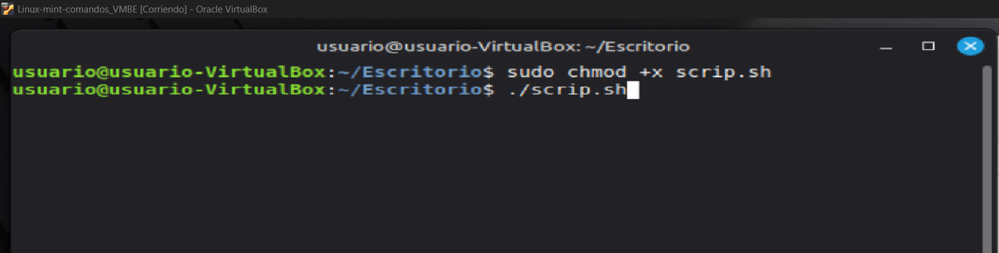

```bash
# Variables = Memoria que coge datos como cadenas de caractéres o números
# variables y se indica con un =
Nombre="Victor"
Apellido="Barragan"

# Para hacer uso de la variable se utiliza $variable ($nombre)
echo "Hola $Nombre $Apellido, bienvenid@s"

# Para pedir informacion al usuario y la guarda en una variable se usa:
read -p "Dime como te llamas: " nombre
echo "bienvenid@s" $nombre

#otro ejemplo de read creando una carpeta
read -p "Dime el nombre de la carpeta: " carpeta
mkdir $carpeta

# Para hacer sumas de dos valor se utiliza:
read -p "valor 1: " v1
read -p "valor 2: " v2

# Reglas matemáticas
suma=$(( v1 + v2 ))
resta=$(( v1 - v2 ))
Producto=$(( v1 * v2 ))
division=$(( v1 / v2 ))
resto=$(( v1 % v2 ))
elevado=$(( v1 ** v2 ))

# Para mostrar el resultado se usa un echo:

echo "La suma de los dos valor es " $suma
echo "La resta de los dos valor es " $resta
echo "La Producto de los dos valor es " $Producto
echo "La division de los dos valor es " $division
echo "La resto de los dos valor es " $resto
echo "La elevado de los dos valor es " $elevado
```
--- --- --- --- ---

#### 🔥 if

``` bash
#Condiciones : Si la condicion es cierta continua, si es falsa se va al [else] y si no lo hay se salta el if y continua debajo del fi.

read -p "Dame tu edad " edad

if [ $edad -ge 18 ]; then
    echo "Eres mayor de edad"
else
    echo "Eres muy joven"
fi

# -ge --> >=
# -le --> <=
# -gt --> >
# -lt --> <
# -eq --> = --> Si es para comparar texto ==
# -ne --> <>

#Multiples condiciones
read -p "Dame tu edad " edad

if [ $edad -gt 18 ]; then
    echo "Eres mayor de edad"

elif [ $edad -eq 18 ]; then
    echo "Ole, acabas de comenzar tu mayoria de edad"

else
    echo "Eres muy joven"

fi
    echo "Bay...."

# Los argumentos (cada espacio) se identifican como :
$1 --> Si solo tiene un dígito
${10} --> Si tiene más de un dígito 

```
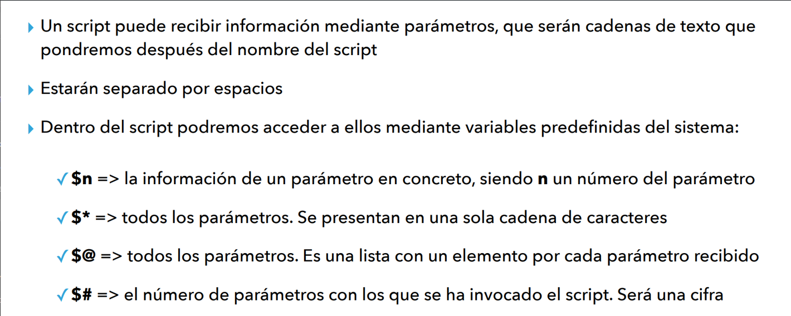

> "Realiza un sripts que se le pase dos parametros numericos y realiza la suma verificando que se le a pasado los dos parametro si no mensaje de error

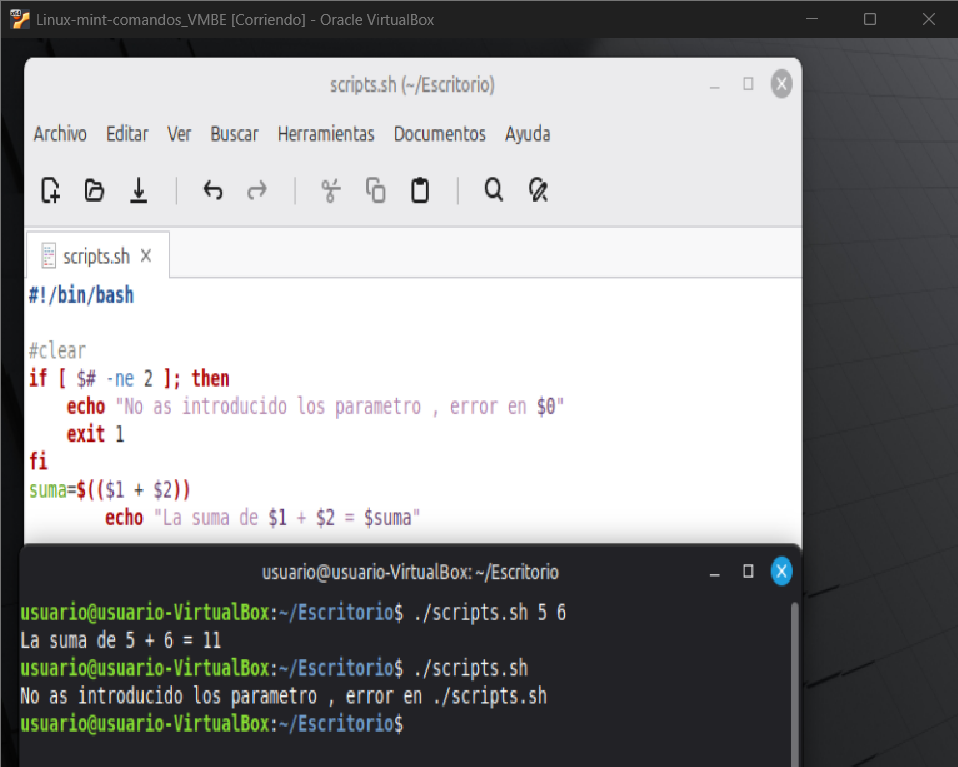

```bash
#login.sh ; Pedir nombre de usuario y contraseña , si el usuario no a metido el usuario y contraseña correcta dara un mensaje de error
```
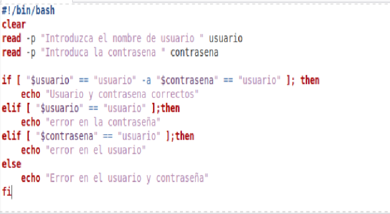

```bash
# Comprobar sintaxis 
```
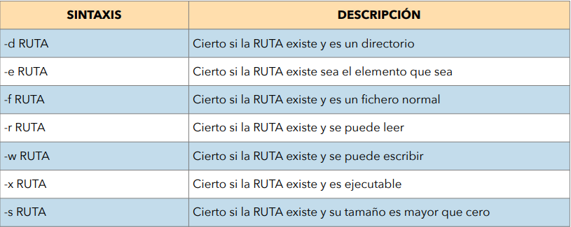
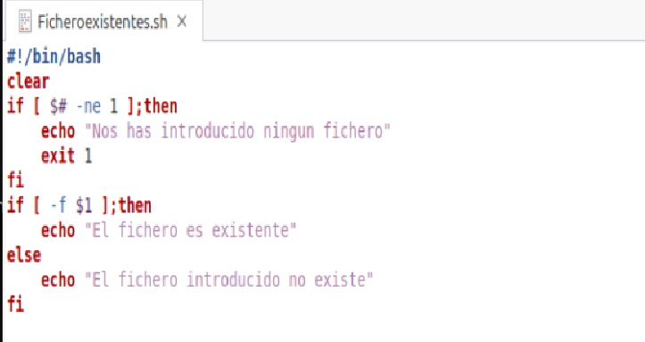

```bash
#Ejemplo : Crea un script donde resiva un nombre de usuario como parametro y comprobar si es usuario existe en sistema
```
> Importante examen:

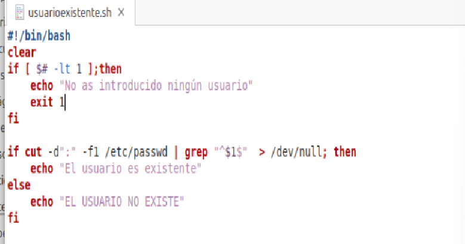

```bash
#Ejemplo validador 
# Crea un scrpt que reciba un nombre de archivo por argumento.
# Si el fichero existe y tenemos permisos de lectura , debe decir ; "Configuración en lista".
# Si existe pero no tiene permisos de lectura, debe decir ; "error: no tengo permisos".
# Si no existe, debe decir:"Error:Archivo no encontrado"
```
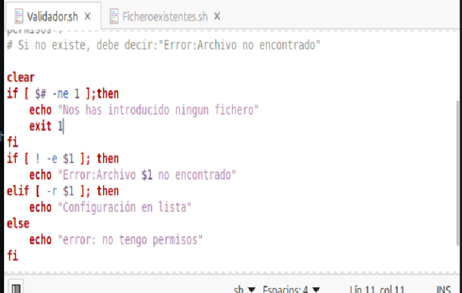

--- --- --- ---

#### 🔥 for

```bash
#for VARIABLE in RECORRIDO do COMANDO done
# El for sirve para crear bucles finitos de veces

#condicion,variable,incremento
for (( i=1; i<=5; i++ ))
do
    echo "Valor: $1"
done

o
# bucles de nombre
for nombre in Victor Manuel Pepe
do
    echo "Hola,$nombre"
done

# bucle de rango de numeros
for i in {20..50}
do
    echo $i
done

# bucles de archivos donde a sido ejecutado
for archivo in *.txt
do 
    cat $archivo
done

```
> Realiza un script por pantalla que muestre del 1-20 los numeros pares

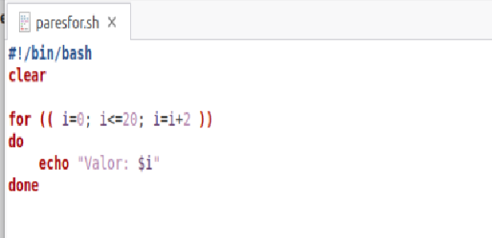

> Realizar un script que se le pase dos numeros por parametros y que muestre por pantalla los numeros comprendidos entre el mayor y el menor 

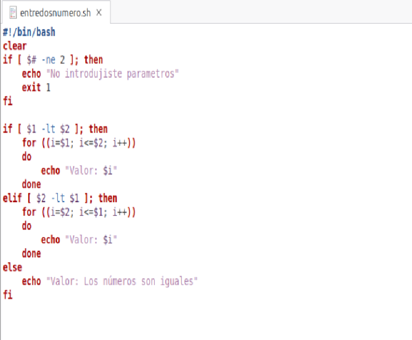

#### 🔥 while

```bash

# El while se utiliza para hacer bucles infinitos.

while Condicion; do
    instruccion
done

Ejemplo:
CONT=0
while [ $CONT -lt 5 ]; do
 echo El contador es $CONT
 $CONT=$(($CONT+1))
done

while true; do = Crea un bucle que no se cierra hasta no llegar a ; break;
```

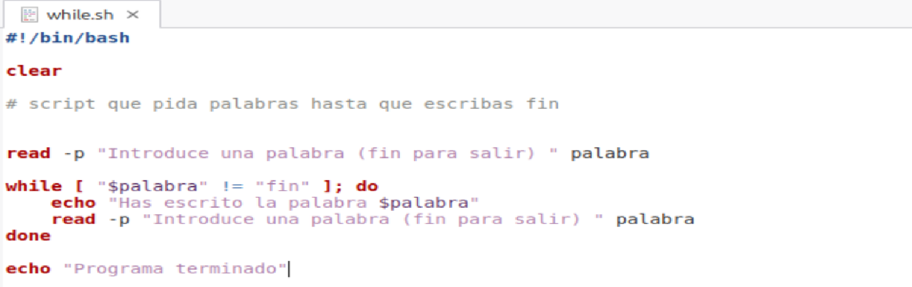

--- --- --- ---

#### 🔥 CASE

```bash
# El case se utiliza para crear menús
#  La sentencia case ejecutará unas instrucciones u otras en función del valor que encuentre en una variable o expresión

```
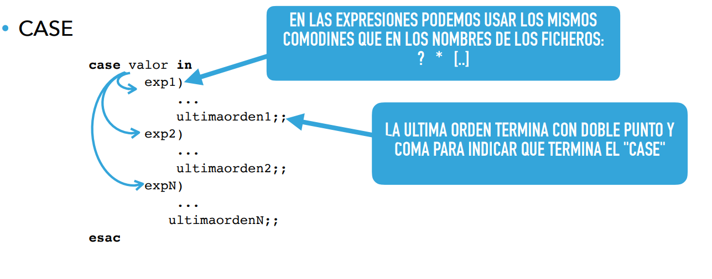

```bash

Ejemplo completo
#Realiza un script que muestre el siguiente menu : 
#1)Crear un fichero(con su nombre) , si existe muestra el mensaje de que existe, si no existe lo crea. 
#2)Borrar un fichero (pide el nombre del fichero a botrrar) si existe lo elimina , si no existe emnsaje de error. 
#3)Listar fichero de un directorio (indicar nombre del directorio) si existe lo muestra , si no existe mensaje de error. 
#4)Monstrar el contenido de un fichero(pide el nombre ) si no existe mensaje de erro , si existe muestra el contenido. 
#5)Pide al usuario la extesion de un fichero y muestra por pantalla todos los fichero de esa extension. 
#6)Salir del programa,solo saldra del programa cuando se pulse esta opcion.
clear

while true; do

echo "**********Menú de opciones**********"
echo "1) crear fichero con tu nombre "
echo "2) Fichero a borrar "
echo "3) Listar fichero de un directorio "
echo "4) Contenido de un fichero "
echo "5) Extencion de un fichero "
echo "6) Limpiar pantalla"
echo "7) Para salir"
read -p "Elige una opción " opciones

    case $opciones in 
        1) read -p "Tu nombre " nombre
            if [ ! -e "$nombre" ];then
            touch $nombre
            else            
            echo "El fichero ya existe"
            fi;; 
        2) read -p "Fichero a borrar " borrar
            if [ -e "$nombre"  ];then
            rm -r $borrar
            else            
            echo "El fichero no existe"
            fi;;
        3) read -p "directorio a listar " listar
            if [ -d "$listar" ];then
            ls -l $listar | grep -e ^[-]
            else 
            echo "El directorio no existe"           
            fi;;
        4) read -p "directorio que quieres ver " dire
            if [ -d "$dire" ];then
            cat $dire
            else
            echo "El directorio no existe"
            fi;;
        5) read -p "extencion a mostrar " ext
            for archivo in *.$ext
            do 
                ls $archivo
            done;;
        6) clear;;
        7) echo "Saliendo"
            break;;
        *) echo "Error, opcion incorrecta" ;;
    esac

done

```
