<h1><center>Git/Github</center></h1>

```bash
# Version Git
git --version
git version 2.52.0.windows.1

# usuario y gmail Git
git config --global user.name vbaresc657
git config --global user.mail vbarraganescudero@gmail.com

# Cual es el usuario y gmail del git
git config --global user.name
git config --global user.mail

# Creamos la carpeta del proyecto y iniciamos el Git
mkdir miProyectoGit
cd .\miProyectoGit\
git init

# Ahora nos metemos en el bash de Git y entramos en la carpeta
```
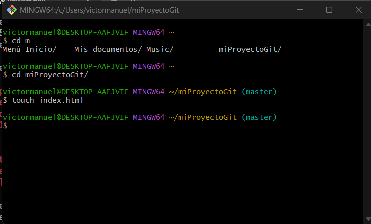

```bash
#Estado de todo lo que contiene la carpeta y si vuelves a atras como no as modificado nada no te deberia salir nada
git status -s

# Lo que te aparece con ?? significa que ese fichero no tiene un significado ; una M roja sin modificaciones y M verde todo correcto

# Para añadir el fichero al repositorio Stage y que el fichero no aparezca con ?? y empieze a funcionar:
git add fichero
git add . #Cuidado monta todo
git stash push fichero -m "descripcion" # guardar fichero de manera temporal
git stash pop #Sacarlo del archivo temporal 

# Para comenzar el seguimiento hay que crear un commit
# git commit -m "verbo: fichero"
# verbo en ingles.
```
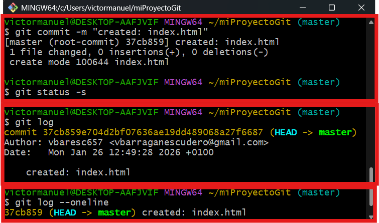
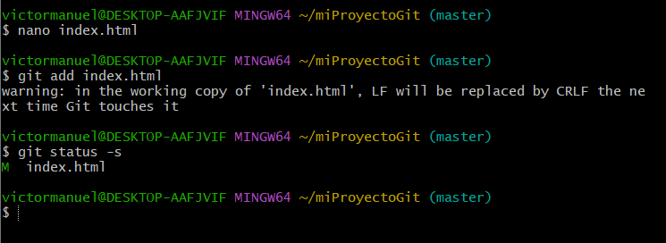

```bash
# Le añadimos una primera version 
 git commit -m "created: Primera version de la web"

 git diff # Modificaciones que se an hecho en los ficheros

# Una vez modifca volvemos a añadirlo y le creamos otro commit pero en vez de crear , actualizar

```
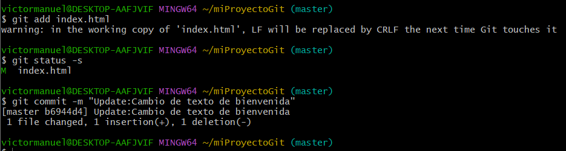

```bash
# Si rompes el fichero sin querer y quiere restablecerlo sin salir de la version donde estas
git restore fichero

#Para borrar un commit hecho por accidente 
git reset --hard HEAD~1

#Para deshacerlo sin borrar el rastro de que alguien cometió ese error (necesario para la auditoría), usamos:

git revert HEAD

# Se abrira un editor crtl+o , ctrl+x = Para guardar y salir
# Si se queda pillado ESC y escribimos :wq

# Para comprobar que sigue en la versión actual
git log --online

# Mostrar todos los commit que tienes
git log

# Cuando haces un commit por error y no puedes volver a la version anterior la sacamos del fichero de seguimiento
git restore --staged fichero

# Para volver a una version anterior
git log --online #copias el numero de la version
640571d --> Identificador copiado
git restore --source 640571d fichero #Pegas la versión

# Eliminar archivos sin seguimiento ??
git clean -n #1.
git clean -f #2.

# El comando de inspeccióna un fichero
git blame index.html

```
```bash
#Crear rama
git switch -c NombreRama

# ahora realizamos cambios y haremos un commit y veremos que ahora apunta a la rama creada
```
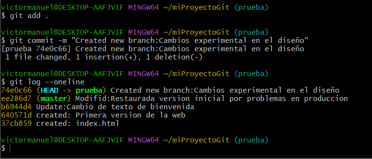

```bash
# Para cambiar de rama para volver por ejemplo a la rama principal
git switch master

# ahora para juntar la rama creada con la principal, hacemos :
git merge ramacreada
(HEAD -> master, prueba)
```
>Trabajando con las ramas

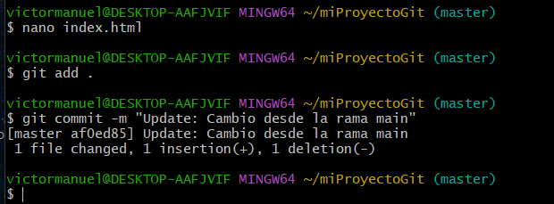
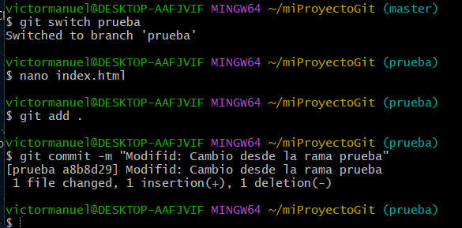

> Arreglando conflictos desde el nano eliminado el conflicto y dejando solo uno.

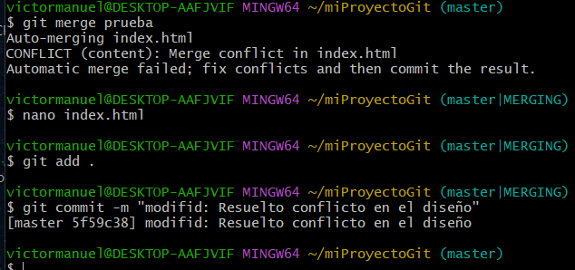
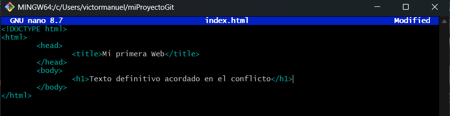

> Pra ocultar fichero del git status -s meteremos los archivos en nano .gitignore.

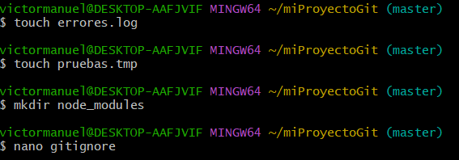
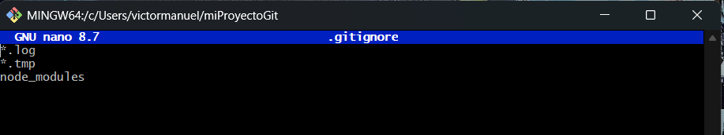
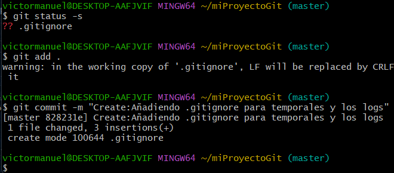

> creamos un repositorio en github : nombre y descripción

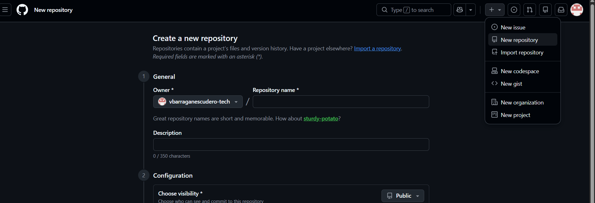

> Crear clave publica y privada por ssh
```bash
ssh-keygen -t ed25519 -C "vbarraganescudero@gmail.com"
```
> Al entrar en el comando lo primero que no pide es la ruta donde quieres meter las claves en mi caso ,enter, porque quiero crearlas hay y luego pide una contraseña y que la confirmes

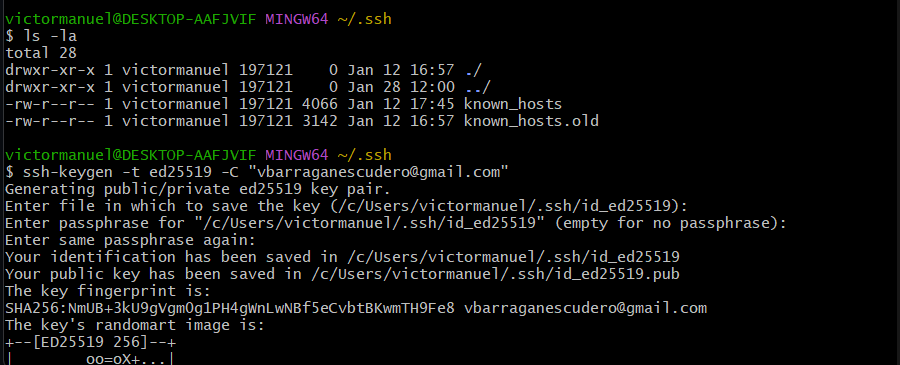

> Para levantar el server ssh y mandar la clave privada al servidor.

```bash
eval "$(ssh-agent -s)"
ssh-add ~/.ssh/id_ed25519
cat id_ed25519.pub #Copiamos lo que salga y lo pegamos en github
```
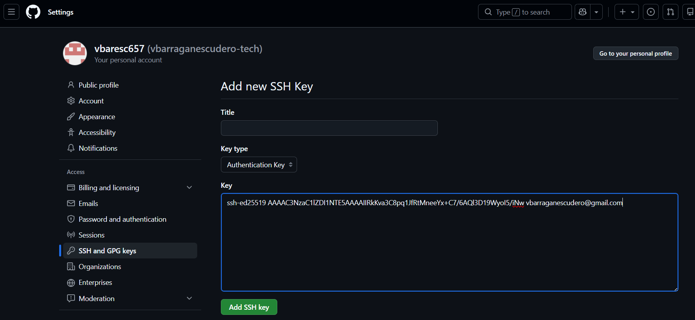

> Ahora accedemos al repositorio creado y copiamos el ssh

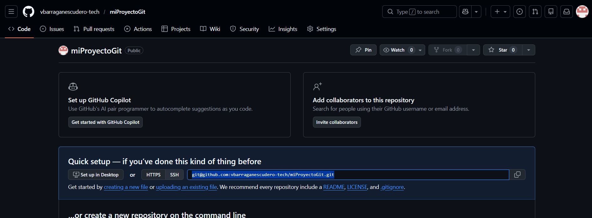

> Ahora comprobamos si esta conectado con ssh (origin: es un nombre que le hemos dado)

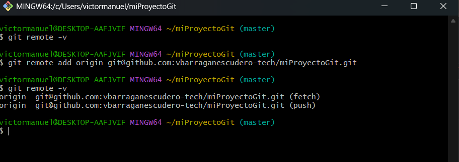

> Ahora subiremos el trabajo

```bash
git push -u Nombre master
```
> Si añadimos un README en github 

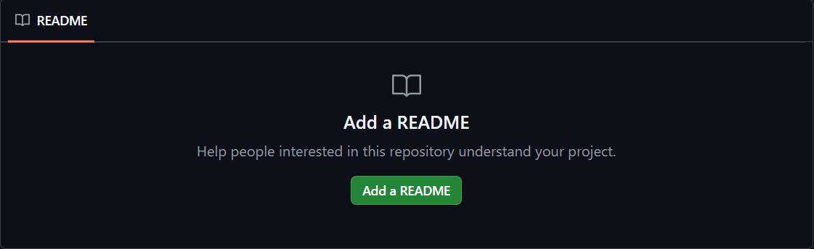

> Para bajarlo en git bash

```bash
git pull origin master
```

> Para trabajar por remoto clonamos el repositorio para trabajar sobre el clon del ssh

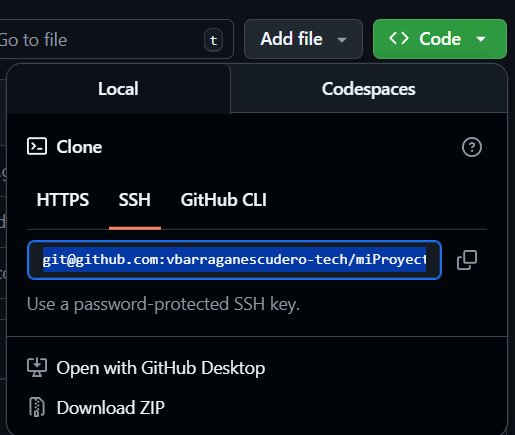

```bash
 git clone git@github.com:vbarraganescudero-tech/miProyectoGit.git
```